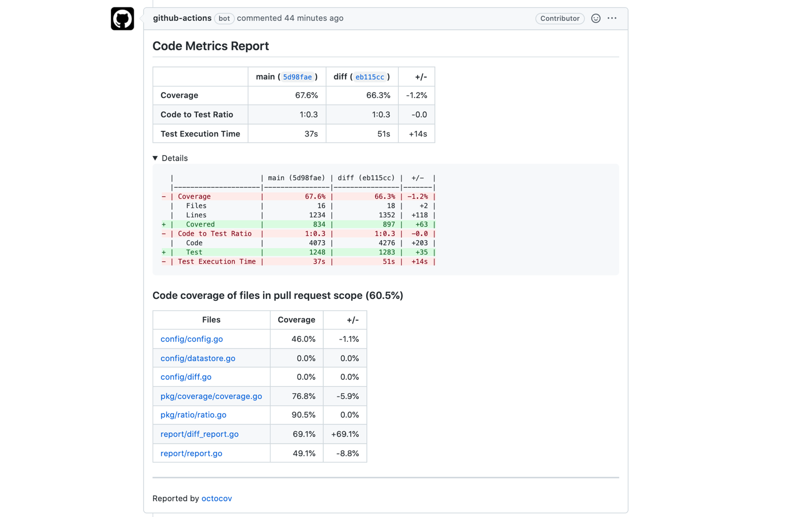
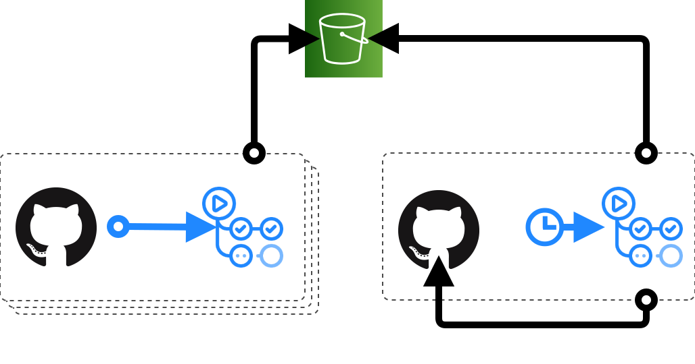
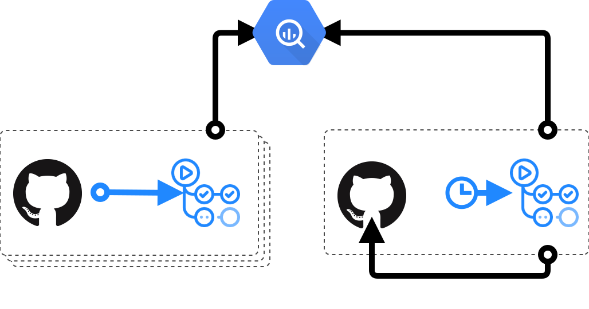

# octocov

[](https://github.com/k1LoW/octocov/actions)   

`octocov` is a tool for collecting code metrics (code coverage, code to test ratio and test execution time).

Key features of `octocov` are:

- **[Support multiple coverage report formats](#supported-coverage-report-formats).**
- **[Support multiple code metrics](#supported-code-metrics).**
- **[Support for even generating coverage report badge](#generate-coverage-report-badge-self).**
- **[Have a mechanism to aggregate reports from multiple repositories](#store-report-to-central-datastore).**

## Getting Started

### On GitHub Actions

**:octocat: GitHub Actions for octocov is [here](https://github.com/k1LoW/octocov-action) !!**

First, run test with [coverage report output](#supported-coverage-report-formats).

For example, in case of Go language, add `-coverprofile=coverage.out` option as follows

``` console
$ go test ./... -coverprofile=coverage.out
```
Add `.octocov.yml` ( or `octocov.yml` ) file to your repository.

``` yaml
# .octocov.yml
coverage:
  path: coverage.out
codeToTestRatio:
  code:
    - '**/*.go'
    - '!**/*_test.go'
  test:
    - '**/*_test.go'
comment:
  enable: true
```

And set up a workflow file as follows and run octocov on GitHub Actions.

``` yaml
# .github/workflows/ci.yml
name: Test

on:
  pull_request:

jobs:
  test:
    runs-on: ubuntu-latest
    steps:
      -
        uses: actions/checkout@v2
      -
        uses: actions/setup-go@v2
        with:
          go-version: 1.17
      -
        name: Run tests with coverage report output
        run: go test ./... -coverprofile=coverage.out
      -
        uses: k1LoW/octocov-action@v0
```

Then, octocov comment the report of the code metrics to the pull request.


### On Terminal

octocov acts as a code metrics viewer on the terminal.

For example, in case of Go language, add `-coverprofile=coverage.out` option as follows

``` console
$ go test ./... -coverprofile=coverage.out
```

And run `octocov ls-files` , `octocov view [FILE...]` and `octocov diff [REPORT_A] [REPORT_B]`


## Usage example

### Comment report to pull request

By setting `comment:`, [comment the reports to pull request](https://github.com/k1LoW/octocov/pull/30#issuecomment-860188829).


``` yaml
# .octocov.yml
comment:
  enable: true
  hideFooterLink: false # hide octocov link
```

octocov checks for **"Code Coverage"** by default. If it is running on GitHub Actions, it will also measure **"Test Execution Time"**.

If you want to measure **"Code to Test Ratio"**, set `codeToTestRatio:`.

``` yaml
comment:
  enable: true
codeToTestRatio:
  code:
    - '**/*.go'
    - '!**/*_test.go'
  test:
    - '**/*_test.go'
```

By setting `diff:` ( `diff.path:`  or `diff.datastores` ) additionally, it is possible to show differences from previous reports as well.

``` yaml
comment:
  enable: true
diff:
  datastores:
    - s3://bucket/reports
```



### Check for acceptable score

By setting `coverage.acceptable:`, the minimum acceptable coverage is specified.

If it is less than that value, the command will exit with exit status `1`.

``` yaml
# .octocov.yml
coverage:
  acceptable: 60%
```

``` console
$ octocov
Error: code coverage is 54.9%, which is below the accepted 60.0%
```

By setting `codeToTestRatio.acceptable:`, the minimum acceptable "Code to Test Ratio" is specified.

If it is less than that value, the command will exit with exit status `1`.

``` yaml
# .octocov.yml
codeToTestRatio:
  acceptable: 1:1.2
  code:
    - '**/*.go'
    - '!**/*_test.go'
  test:
    - '**/*_test.go'
```

``` console
$ octocov
Error: code to test ratio is 1:1.1, which is below the accepted 1:1.2
```

By setting `testExecutionTime.acceptable:`, the maximum acceptable "Test Execution Time" is specified **(on GitHub Actions only)** .

If it is greater than that value, the command will exit with exit status `1`.

``` yaml
# .octocov.yml
testExecutionTime:
  acceptable: 1 min
```

``` console
$ octocov
Error: test execution time is 1m15s, which is above the accepted 1m
```

### Generate report badges self.

By setting `*.badge.path:`, generate badges self.

``` yaml
# .octocov.yml
coverage:
  badge:
    path: docs/coverage.svg
```

``` yaml
# .octocov.yml
codeToTestRatio:
  badge:
    path: docs/ratio.svg
```

``` yaml
# .octocov.yml
testExecutionTime:
  badge:
    path: docs/time.svg
```

You can display the coverage badge without external communication by setting a link to this badge image in README.md, etc.

``` markdown
# mytool


```


### Push report badges self.

By setting `push.enable:`, git push report badges self.

``` yaml
# .octocov.yml
coverage:
  badge:
    path: docs/coverage.svg
push:
  enable: true
```

### Store report to datastores

By setting `report:`, store the reports to datastores and local path.

``` yaml
# .octocov.yml
report:
  datastores:
    - github://owner/coverages/reports
    - s3://bucket/reports
```

``` yaml
# .octocov.yml
report:
  path: path/to/report.json
```

#### Supported datastores

- GitHub repository
- S3
- GCS
- BigQuery
- Local

### Central mode

By enabling `central:`, `octocov` acts as a central repository for collecting reports ( [example](example/central/README.md) ).

``` yaml
# .octocov.yml for central mode
central:
  enable: true
  root:                    .             # root directory or index file path of collected coverage reports pages. default: .
  reports:
    - bq://my-project/my-dataset/reports # datastore paths (URLs) where reports are stored. default: local://reports
  badges: badges                         # directory where badges are generated. default: badges
  push:
    enable: true                         # enable self git push
```

#### Supported datastores

- GitHub repository
- S3
- GCS
- BigQuery
- Local

### View code coverage report of file

`octocov ls-files` command can be used to list files logged in code coverage report.

`octocov view` (alias: `octocov cat`) command can be used to view the file coverage report.


## Configuration

### `coverage:`

Configuration for code coverage.

### `coverage.path:`

The path to the coverage report file.

If no path is specified, the default path for each coverage format will be scanned.

``` yaml
coverage:
  path: tests/coverage.xml
```

### `coverage.acceptable:`

The minimum acceptable coverage.

``` yaml
coverage:
  acceptable: 60%
```

### `coverage.badge:`

Set this if want to generate the badge self.

### `coverage.badge.path:`

The path to the badge.

``` yaml
coverage:
  badge:
    path: docs/coverage.svg
```

### `codeToTestRatio:`

Configuration for code to test ratio.

### `codeToTestRatio.code:` `codeToTestRatio.test:`

Files to count.

``` yaml
codeToTestRatio:
  code:                  # files to count as "Code"
    - '**/*.go'
    - '!**/*_test.go'
  test:                  # files to count as "Test"
    - '**/*_test.go'
```

### `codeToTestRatio.acceptable:`

The minimum acceptable ratio.

``` yaml
codeToTestRatio:
  acceptable: 1:1.2
```

### `codeToTestRatio.badge:`

Set this if want to generate the badge self.

### `codeToTestRatio.badge.path:`

The path to the badge.

``` yaml
codeToTestRatio:
  badge:
    path: docs/ratio.svg
```

### `testExecutionTime:`

Configuration for test execution time.

### `testExecutionTime.acceptable`

The minimum acceptable time.

``` yaml
testExecutionTime:
  acceptable: 1min
```

### `testExecutionTime.badge`

Set this if want to generate the badge self.

### `testExecutionTime.badge.path`

The path to the badge.

``` yaml
testExecutionTime:
  badge:
    path: docs/time.svg
```

### `push:`

Configuration for `git push` badges self.

### `push.enable:`

Enable `git push`

``` yaml
push:
  enable: true
```

### `comment:`

Set this if want to comment report to pull request

### `comment.enable:`

Enable comment.

``` yaml
comment:
  enable: true
```

### `comment.hideFooterLink:`

Hide footer [octocov](https://github.com/k1LoW/octocov) link.

``` yaml
comment:
  hideFooterLink: true
```

### `diff:`

Configuration for comparing reports.

### `diff.path:`

Path of the report to compare.

``` yaml
diff:
  path: path/to/coverage.yml
```

``` yaml
diff:
  path: path/to/report.json
```

### `diff.datastores:`

Datastores where the report to be compared is stored.

``` yaml
diff:
  datastores:
    - local://.octocov       # Use .octocov/owner/repo/report.json
    - s3://my-bucket/reports # Use s3://my-bucket/reports/owner/repo/report.json
```

### `diff.if:`

Conditions for comparing reports

``` yaml
# .octocov.yml
report:
  if: github.event_name == 'pull_request'
  path: path/to/report.json
```

### `report:`

Configuration for reporting to datastores.

### `report.path:`

Path to save the report.

``` yaml
report:
  path: path/to/report.json
```

### `report.datastores:`

Datastores where the reports are saved.

``` yaml
report:
  datastores:
    - github://owner/coverages/reports
    - s3://bucket/reports
```

#### GitHub repository

Use `github://` scheme.

```
github://[owner]/[repo]@[branch]/[prefix]
```

**Required environment variables:**

- `GITHUB_TOKEN` or `OCTOCOV_GITHUB_TOKEN`
- `GITHUB_REPOSITORY` or `OCTOCOV_GITHUB_REPOSITORY`
- `GITHUB_API_URL` or `OCTOCOV_GITHUB_API_URL` (optional)

#### S3

Use `s3://` scheme.

```
s3://[bucket]/[prefix]
```

**Required permission:**

- `s3:PutObject`

**Required environment variables:**

- `AWS_ACCESS_KEY_ID` or `OCTOCOV_AWS_ACCESS_KEY_ID`
- `AWS_SECRET_ACCESS_KEY` or `OCTOCOV_AWS_SECRET_ACCESS_KEY`
- `AWS_SESSION_TOKEN` or `OCTOCOV_AWS_SESSION_TOKEN` (optional)

#### GCS

Use `gs://` scheme.

```
gs://[bucket]/[prefix]
```

**Required permission:**

- `storage.objects.create`
- `storage.objects.delete`

**Required environment variables:**

- `GOOGLE_APPLICATION_CREDENTIALS` or `GOOGLE_APPLICATION_CREDENTIALS_JSON` or `OCTOCOV_GOOGLE_APPLICATION_CREDENTIALS` or `OCTOCOV_GOOGLE_APPLICATION_CREDENTIALS_JSON`

#### BigQuery

Use `bq://` scheme.

```
bq://[project ID]/[dataset ID]/[table]
```

**Required permission:**

- `bigquery.datasets.get`
- `bigquery.tables.get`
- `bigquery.tables.updateData`

**Required environment variables:**

- `GOOGLE_APPLICATION_CREDENTIALS` or `GOOGLE_APPLICATION_CREDENTIALS_JSON` or `OCTOCOV_GOOGLE_APPLICATION_CREDENTIALS` or `OCTOCOV_GOOGLE_APPLICATION_CREDENTIALS_JSON`

**Datastore schema:**

[Datastore schema](docs/bq/schema/README.md)

If you want to create a table, execute the following command ( require `bigquery.datasets.create` ).

``` console
$ octocov --create-bq-table
```

#### Local

Use `local://` or `file://` scheme.

```
local://[path]
```

**Example:**

If the absolute path of `.octocov.yml` is `/path/to/.octocov.yml`

- `local://reports` ... `/path/to/reports` directory
- `local://.reports` ... `/path/to/reports` directory
- `local://../reports` ... `/path/reports` directory
- `local:///reports` ... `/reports` directory.

### `report.if:`

Conditions for saving a report.

``` yaml
# .octocov.yml
report:
  if: env.GITHUB_REF == 'refs/heads/main'
  datastores:
    - github://owner/coverages/reports
```

The variables available in the `if` section are as follows

| Variable name | Type | Description |
| --- | --- | --- |
| `year` | `int` | Year of current time (UTC) |
| `month` | `int` | Month of current time (UTC) |
| `day` | `int` | Day of current time (UTC) |
| `hour` | `int` | Hour of current time (UTC) |
| `weekday` | `int` | Weekday of current time (UTC) (Sunday = 0, ...) |
| `github.event_name` | `string` | Event name of GitHub Actions ( ex. `issues`, `pull_request` )|
| `github.event` | `object` | Detailed data for each event of GitHub Actions (ex. `github.event.action`, `github.event.label.name` ) |
| `env.<env_name>` | `string` | The value of a specific environment variable |

### `central:`

### `central.enable:`

Enable central mode.

``` yaml
central:
  enable: true
```

:NOTICE: When central mode is enabled, other functions are automatically turned off.


### `central.root:`

The root directory or index file ( [index file example](example/central/README.md) ) path of collected coverage reports pages. default: `.`

``` yaml
central:
  root: path/to
```

### `central.reports:`

### `central.reports.datastores:`

Datastore paths (URLs) where reports are stored. default: `local://reports`

``` yaml
central:
  reports:
    datastores:
      - local://reports
      - gs://my-gcs-bucket/reports
```

#### Use GitHub repository as datastore

When using the central repository as a datastore, perform badge generation via on.push.


``` yaml
# .octocov.yml
report:
  datastores:
    - github://owner/central-repo/reports
```

``` yaml
# .octocov.yml for central repo
central:
  enable: true
  reports:
    datastores:
      - local://reports
  push:
    enable: true
```

#### Use S3 bucket as datastore

When using the S3 bucket as a datastore, perform badge generation via on.schedule.



``` yaml
# .octocov.yml
report:
  datastores:
    - s3://my-s3-bucket/reports
```

``` yaml
# .octocov.yml for central repo
central:
  enable: true
  reports:
    datastores:
      - s3://my-s3-bucket/reports
  push:
    enable: true
```

**Required permission (Central Repo):**

- `s3:GetObject`
- `s3:ListObject`

**Required environment variables (Central Repo):**

- `AWS_ACCESS_KEY_ID` or `OCTOCOV_AWS_ACCESS_KEY_ID`
- `AWS_SECRET_ACCESS_KEY` or `OCTOCOV_AWS_SECRET_ACCESS_KEY`
- `AWS_SESSION_TOKEN` or `OCTOCOV_AWS_SESSION_TOKEN` (optional)

#### Use GCS bucket as datastore


When using the GCS bucket as a datastore, perform badge generation via on.schedule.

``` yaml
# .octocov.yml
report:
  datastores:
    - gs://my-gcs-bucket/reports
```

``` yaml
# .octocov.yml for central repo
central:
  enable: true
  reports:
    datastores:
      - gs://my-gcs-bucket/reports
  push:
    enable: true
```

**Required permission (Central Repo):**

- `storage.objects.get`
- `storage.objects.list`
- `storage.buckets.get`

**Required environment variables (Central Repo):**

- `GOOGLE_APPLICATION_CREDENTIALS` or `GOOGLE_APPLICATION_CREDENTIALS_JSON` or `OCTOCOV_GOOGLE_APPLICATION_CREDENTIALS` or `OCTOCOV_GOOGLE_APPLICATION_CREDENTIALS_JSON`

#### Use BigQuery table as datastore



When using the BigQuery table as a datastore, perform badge generation via on.schedule.

``` yaml
# .octocov.yml
report:
  datastores:
    - bq://my-project/my-dataset/reports
```

``` yaml
# .octocov.yml for central repo
central:
  enable: true
  reports:
    datastores:
      - bq://my-project/my-dataset/reports
  push:
    enable: true
```

**Required permission (Central Repo):**

- `bigquery.jobs.create`
- `bigquery.tables.getData`

**Required environment variables (Central Repo):**

- `GOOGLE_APPLICATION_CREDENTIALS` or `GOOGLE_APPLICATION_CREDENTIALS_JSON` or `OCTOCOV_GOOGLE_APPLICATION_CREDENTIALS` or `OCTOCOV_GOOGLE_APPLICATION_CREDENTIALS_JSON`

### `central.badges:`

Directory where badges are generated. default: `badges`

``` yaml
central:
  badges: badges
```

Support local only.

### `central.push:`

Configuration for `git push` index file and badges self.

### `central.push.enable:`

Enable `git push`

``` yaml
push:
  enable: true
```

## Supported coverage report formats

octocov supports multiple coverage report formats.

And octocov searches for the default path for each format.

If you want to specify the path of the report file, set `coverage.path`

``` yaml
coverage:
  path: /path/to/coverage.txt
```

### Go coverage

**Default path:** `coverage.out`

### LCOV

**Default path:** `coverage/lcov.info`

Support `SF` `DA` only

### SimpleCov

**Default path:** `coverage/.resultset.json`

### Clover

**Default path:** `coverage.xml`

### Cobertura

**Default path:** `coverage.xml`

## Supported code metrics

- **Code Coverage**
- **Code to Test Ratio**
- **Test Execution Time** (on GitHub Actions only)

## Install

**deb:**

Use [dpkg-i-from-url](https://github.com/k1LoW/dpkg-i-from-url)

``` console
$ export OCTOCOV_VERSION=X.X.X
$ curl -L https://git.io/dpkg-i-from-url | bash -s -- https://github.com/k1LoW/octocov/releases/download/v$OCTOCOV_VERSION/octocov_$OCTOCOV_VERSION-1_amd64.deb
```

**RPM:**

``` console
$ export OCTOCOV_VERSION=X.X.X
$ yum install https://github.com/k1LoW/octocov/releases/download/v$OCTOCOV_VERSION/octocov_$OCTOCOV_VERSION-1_amd64.rpm
```

**apk:**

Use [apk-add-from-url](https://github.com/k1LoW/apk-add-from-url)

``` console
$ export OCTOCOV_VERSION=X.X.X
$ curl -L https://git.io/apk-add-from-url | sh -s -- https://github.com/k1LoW/octocov/releases/download/v$OCTOCOV_VERSION/octocov_$OCTOCOV_VERSION-1_amd64.apk
```

**homebrew tap:**

```console
$ brew install k1LoW/tap/octocov
```

**manually:**

Download binary from [releases page](https://github.com/k1LoW/octocov/releases)

**go get:**

```console
$ go get github.com/k1LoW/octocov
```

**docker:**

```console
$ docker pull ghcr.io/k1low/octocov:latest
```
